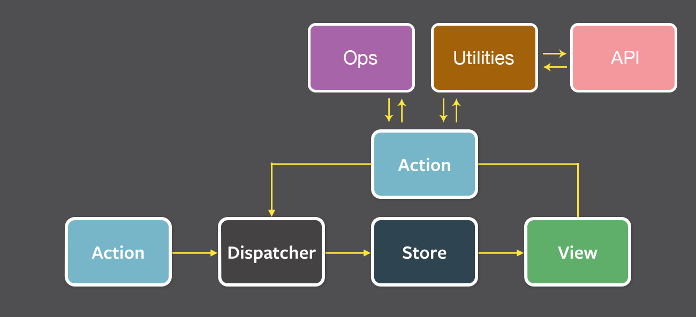
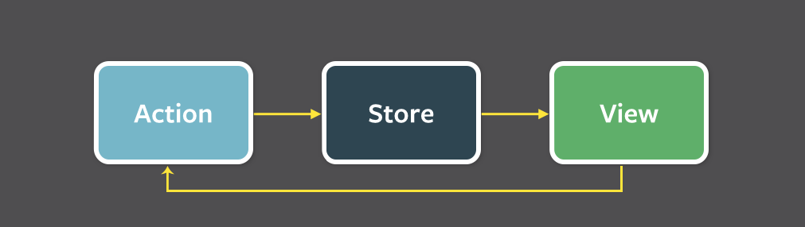
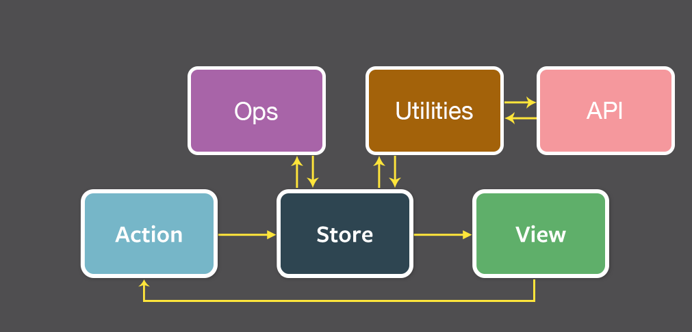

# React stuffs <!-- .element: class="main-title white-color" -->
<!-- .slide: data-background="images/magic-book.jpg" -->

Note:
This is the main slide... what could you possibly be expecting to see here?


# AJ Webb
## Software Engineer, Tanner Labs
### @webbushka <small>(everywhere)</small> <!-- .element: class="vert-align" -->
<!-- .slide: data-background="images/aj.png" data-background-position="right bottom" data-background-size="500px" -->

Note:
I'm AJ Webb, I am a software engineer for Tanner Labs in salt lake city utah. I can be find all around the interwebs as @webbushka


# slides
[https://github.com/webbushka/react-stuffs-slides](https://github.com/webbushka/react-stuffs-slides)


# Angular vs React <!-- .element: class="white-color" -->
<!-- .slide: data-background="images/ku-panda.gif" -->
> "React allows you to essentially  
create a page, of single page apps"  
&mdash; Alexandr Marinenko <!-- .element: class="white-color" -->


## Angular Pros  

* Mostly transparent updates <!-- .element: class="fragment" -->
* Good Coupling <!-- .element: class="fragment" -->

Note:
* Mostly transparent updates  
* Good Coupling -> you don't have to think about updating the data, it just happens


## Angular Cons

* Unpredictable performance <!-- .element: class="fragment" -->
* Can obscure data flow <!-- .element: class="fragment" -->
* Leaky watch abstraction <!-- .element: class="fragment" -->
* Directives and Services create scoping nightmares <!-- .element: class="fragment" -->
	* Complects all the things <!-- .element: class="fragment" -->
	* cannot ever be a page of SPAs <!-- .element: class="fragment" -->

and WORST of all <!-- .element: class="fragment" -->

Note:
* Angular's style of dirty checking has the most unpredictable performance.  
* obscures data flow aka MAGIC!  
* If you want an object to update another object you have to register watches whenever those are outside of the DOM


## It's too much freaking...


## React Pros

* Explicit data flow <!-- .element: class="fragment" -->
* Reasonably predictable performance <!-- .element: class="fragment" -->
* Resuable components <!-- .element: class="fragment" -->
	* Not coupled tightly to the application  
	(so long as they aren't container components) <!-- .element: class="fragment" -->
* Components can fetch state or be hydrated with props <!-- .element: class="fragment" -->
	* Each component is a small SPA <!-- .element: class="fragment" -->

Note:
Very predictable data flow, the data always changes through the parent components. Then all the children re-render. React compares the DOM against itself to see if it needs to make a change. The idea that some owner in your view hierarchy that owns data and it gives permission downward to mutate it.


## React Cons

* Explicit updates <!-- .element: class="fragment" -->
* Performance edge cases <!-- .element: class="fragment" -->
* Server coordination can be difficult without flux <!-- .element: class="fragment" -->

Note:
* The parent to child data flow can be bad when you are getting data from a server then you have to figure out how to get that data to the correct parent components.
* Angular diffs all of the application's data to do its dirty checking and react just diffs what would appear on the screen to what is on the screen to see if it needs to update.


# Welbe <span class="fragment fade-in">+ React</span>
# = <!-- .element: class="fragment" -->
 <!-- .element: class="fragment welbe no-border" -->


## Why is Welbe Moving to React?

* Angular caused too many complexities <!-- .element: class="fragment" -->
* The Angular implementation had performance issues <!-- .element: class="fragment" -->
* Needed to use something more modular and performant <!-- .element: class="fragment" -->


# Flux
What is it? <!-- .element: class="fragment" -->


> "Flux is an application architecture for React"


 <!-- .element: class="no-border" -->
<!-- .slide: data-background-color="#4f4e50" -->


 <!-- .element: class="no-border" -->
<!-- .slide: data-background-color="#4f4e50" -->

Note:
Action creators are helper methods, collected into a library, that create an aciton from method parameters, assign it a type and provide it to the dispatcher.  

Every action is sent to all stores via the callbacks the stores register with the dispatcher.

After stores update themselves in response to an action they emit a change event.  
Container (aka controller or parent) views, listen for change events, retrieve the new data from the stores and provide the new data to the entire tree of their child views.


 <!-- .element: class="no-border" -->
<!-- .slide: data-background-color="#4f4e50" -->


# It's Perfect!


<!-- .slide: data-background="images/lessons.gif" -->


# Lessons Learned
### (what would/will we do differently) <!-- .element: class="fragment" -->


# Reflux instead of Flux
WTF is reflux? <!-- .element: class="fragment" -->


 <!-- .element: class="no-border" -->
<!-- .slide: data-background-color="#4f4e50" -->


 <!-- .element: class="no-border" -->
<!-- .slide: data-background-color="#4f4e50" -->


# Immutable JS
Currently we either mutate data or do something like

```JavaScript
let original = {a:'1', b:2, c:3};
let changed = JSON.parse(JSON.stringify(original));
changed.b = 50;
console.log(original.b) // 2
console.log(changed.b) // 50
```

when we don't want to mutate the data


<!-- .slide: data-background="images/bored.gif" -->


# Babel
Allows us to write ES6 and compiles it back to ES5 <!-- .element: class="fragment" -->


# ES6
Let's see what's new! <!-- .element: class="fragment" -->


## Base Types in JavaScript
* Number
* String
* Object
* Undefined
* Null
* Boolean
* Symbol <!-- .element: class="fragment fade-in red" -->


## Variable Declaration
* var
* function
* let <!-- .element: class="fragment fade-in red" -->
* const <!-- .element: class="fragment fade-in red" -->
* import <!-- .element: class="fragment fade-in red" -->
* class <!-- .element: class="fragment fade-in red" -->


## let & const

function scoped: <!-- .element: class="fragment align-left" -->
```JavaScript
function() {
	if (true) {
		var i = 'hello';
	}
	console.log(i); // hello
}
```
<!-- .element: class="fragment" -->

block scoped: <!-- .element: class="fragment align-left" -->
```JavaScript
function() {
	if (true) {
		const i = 'hello';
		let j = 'world';
	}
	console.log(i) // ReferenceError
	console.log(j) // ReferenceError
}
```
<!-- .element: class="fragment" -->


## let & const

hoisted: <!-- .element: class="fragment align-left" -->
```JavaScript
function() {
	console.log(a); // undefined
	var a = 'var';
}
```
<!-- .element: class="fragment" -->

not hoisted: <!-- .element: class="fragment align-left" -->
```JavaScript
function() {
	console.log(a); // ReferenceError
	console.log(b); // ReferenceError

	let a = 'let';
	const b = 'const';
}
```
<!-- .element: class="fragment" -->


### `const` must be immediately <br/> initialized and is "immutable"

```JavaScript
const foo; // SyntaxError
```

#### While the value cannot change, the properties can <!-- .element: class="fragment" -->

```JavaScript
const foo = someObject;
foo = someOtherObject; // SyntaxError
foo.bar = 'hello';
```
<!-- .element: class="fragment" -->


# Modules
* Completely hoisted <!-- .element: class="fragment" -->
* Circular dependencies just work <!-- .element: class="fragment" -->
* Static analysis <!-- .element: class="fragment" -->


## Simple Syntax

```JavaScript
import React from 'react';
import ApiClient from './lib/ApiClient';

class MyComponent extends React.Component {
	...
}

export MyComponent;
```


## Default Exports

```JavaScript
// example.js
export default function() {...};

// example2.js
import ex from './example';

ex();
```


## Named Exports

```JavaScript
// example.js
export function ex1() {...};
export function ex2() {...};
export function ex3() {...};

// example2.js
import {ex2, ex3} from './example.js';
```


## Import Aliasing

```JavaScript
// example.js
export function ex1() {...};
export function ex2() {...};
export function ex3() {...};

// example2.js
import * as EX from './example.js';

EX.ex1();
EX.ex2();
```


## Good
```JavaScript
// component.js
import Header from './components/header';
import Button from './components/button';
import Footer from './components/footer';

render() {
	return (
		<Header />
		<Button />
		<Footer />
	)
}
```


## Better
```JavaScript
// index.js
import Header from './header';
import Button from './button';
import Footer from './footer';

export default { Header, Button, Footer };

// component.js
import { Header, Button, Footer } from './components/';

render() {
	return (
		<Header />
		<Button />
		<Footer />
	)
}
```


## Best
`export from`
```JavaScript
// index.js
export Header from './header';
export Button from './button';
export Footer from './footer';

// component.js
import { Header, Button, Footer } from './components/';

render() {
	return (
		<Header />
		<Button />
		<Footer />
	)
}
```


# Class


### Prototype inheritance
```JavaScript
function Dog() {...}
Dog.prototype = new Animal();
```

### Class inheritance <!-- .element: class="fragment" -->
```JavaScript
class Dog extends Animal {
	...
}
```
<!-- .element: class="fragment" -->


## Using with React
```JavaScript
'use strict';
import React from 'react';

class EmployeeCount extends React.Component {
	constructor(props) {
		super(props);
		this.state = { company: props.company };
	}

	render() {
		return (
			<div>
				Active Employees: {this.state.company.employeeCount}
			</div>
		)
	}
}

EmployeeCount.propTypes = { company: React.PropTypes.object.isRequired };
EmployeeCount.defaultProps = { company: {} };

export default EmployeeCount;
```


## Better
```JavaScript
'use strict';
import React from 'react';

export class EmployeeCount extends React.Component {
	static propTypes = {
		company: React.PropTypes.object.isRequired
	}

	static defaultProps = {
		company: {}
	}

	constructor(props) {
		super(props);
		this.state = { company: props.company };
	}

	render() {
		return (
			<div>
				Active Employees: {this.state.company.employeeCount}
			</div>
		)
	}
}
```


## Tacos! <!-- .element: class="white-color shadow" -->
<!-- .slide: data-background="images/tacos.jpg" -->
```JavaScript
'use strict';

const log = console.info.bind(console);

class MenuItem {
	constructor() {
		this.name = "Menu Item";
	}

	eat() {
		log(`Eating ${this.name}`);
	}
}

class Taco extends MenuItem {
	constructor() {
		super();
		this.name = 'Taco';
	}
}

class Burrito extends MenuItem {
	constructor() {
		super();
		this.name = 'Burrito';
	}
}

const items = [new Taco(), new Burrito()]

items.forEach(i => i.eat());
```


## Compiled <!-- .element: class="white-color shadow" -->
<!-- .slide: data-background="images/tacos.jpg" -->

```JavaScript
'use strict';

var _get = function get(_x, _x2, _x3) { var _again = true; _function: while (_again) { var object = _x, property = _x2, receiver = _x3; desc = parent = getter = undefined; _again = false; if (object === null) object = Function.prototype; var desc = Object.getOwnPropertyDescriptor(object, property); if (desc === undefined) { var parent = Object.getPrototypeOf(object); if (parent === null) { return undefined; } else { _x = parent; _x2 = property; _x3 = receiver; _again = true; continue _function; } } else if ('value' in desc) { return desc.value; } else { var getter = desc.get; if (getter === undefined) { return undefined; } return getter.call(receiver); } } };

var _createClass = (function () { function defineProperties(target, props) { for (var i = 0; i < props.length; i++) { var descriptor = props[i]; descriptor.enumerable = descriptor.enumerable || false; descriptor.configurable = true; if ('value' in descriptor) descriptor.writable = true; Object.defineProperty(target, descriptor.key, descriptor); } } return function (Constructor, protoProps, staticProps) { if (protoProps) defineProperties(Constructor.prototype, protoProps); if (staticProps) defineProperties(Constructor, staticProps); return Constructor; }; })();

function _inherits(subClass, superClass) { if (typeof superClass !== 'function' && superClass !== null) { throw new TypeError('Super expression must either be null or a function, not ' + typeof superClass); } subClass.prototype = Object.create(superClass && superClass.prototype, { constructor: { value: subClass, enumerable: false, writable: true, configurable: true } }); if (superClass) subClass.__proto__ = superClass; }

function _classCallCheck(instance, Constructor) { if (!(instance instanceof Constructor)) { throw new TypeError('Cannot call a class as a function'); } }

var log = console.info.bind(console);

var MenuItem = (function () {
	function MenuItem() {
		_classCallCheck(this, MenuItem);

		log('Menu item created');
		this.name = 'Menu Item';
	}

	_createClass(MenuItem, [{
		key: 'eat',
		value: function eat() {
			log('Eating ' + this.name);
		}
	}]);

	return MenuItem;
})();

var Taco = (function (_MenuItem) {
	function Taco() {
		_classCallCheck(this, Taco);

		_get(Object.getPrototypeOf(Taco.prototype), 'constructor', this).call(this);
		log('Taco created');

		this.name = 'Taco';
	}

	_inherits(Taco, _MenuItem);

	return Taco;
})(MenuItem);

var Burrito = (function (_MenuItem2) {
	function Burrito() {
		_classCallCheck(this, Burrito);

		_get(Object.getPrototypeOf(Burrito.prototype), 'constructor', this).call(this);
		log('Burrito created');

		this.name = 'Burrito';
	}

	_inherits(Burrito, _MenuItem2);

	return Burrito;
})(MenuItem);

var items = [new Taco(), new Burrito()];

items.forEach(function (i) {
	return i.eat();
});
```


# Babel is **NOT** perfect


### Class inheritance has a small performance hit
<small class="fragment">the more you inherit the bigger the performance cut</small>
<small class="fragment">... as with life, be smart with your inheritance</small>


## Too much inheritance <!-- .element: class="white-color shadow" -->
<!-- .slide: data-background="images/tacos.jpg" -->

```JavaScript
'use strict';

class MenuItem {
	constructor() {
		this.name = 'Menu Item';
	}

	eat() {
		console.info(`Eating ${this.name}`);
	}
}

class Taco extends MenuItem {
	constructor() {
		super();
		this.name = 'Taco';
	}
}

class HardTaco extends Taco {
	constructor() {
		super();
		this.name = 'Hard Taco';
	}
}

class BeefTaco extends HardTaco {
	constructor() {
		super();
		this.name = 'Beef Taco';
	}
}

class SpicyTaco extends BeefTaco {
	constructor() {
		super();
		this.name = 'Spicy Taco';
	}
}

class Burrito extends MenuItem {
	constructor() {
		super();
		this.name = 'Burrito';
	}
}

let items = [new Taco(), new Burrito(), new SpicyTaco()];

items.forEach(i => i.eat());

```


# Destructuring


## Before
```JavaScript
const arr = [1, 2, 3];
const x = arr[0];
const y = arr[1];

function(obj) {
	const value = obj.value;
}

const name = this.props.name;
const dob = this.props.dobs;
```

## After <!-- .element: class="fragment" -->
```JavaScript
const [x, y] = [1, 2, 3];

function({ value }) {}

const {name, dob} = this.props;
```
<!-- .element: class="fragment" -->


## Avoid overly complex destructuring

```JavaScript
// Fun
const {props: {fontStyle, user}, state: {name}, context: {router}} = this;
```
<!-- .element: class="fragment" -->

```JavaScript
// More understandable
const {fontStyle, user} = this.props;
const {name} = this.state;
const {router} = this.context;
```
<!-- .element: class="fragment" -->


## Before
```JavaScript
updateState(payload) {
	const name = payload.name || 'stranger';
	this.setState({
		name: name
	});
}
```

## After
```JavaScript
updateState({ name = 'stranger'}) {
	this.setState({name});
}
```


# Spread and Rest


```JavaScript
// Arrays - ES6
const arr = [1, 2, 3];
...arr; // 1 2 3

// Objects - ESNext
const obj = {a: 1, b: 2, c: 3};
...obj; // {a: 1, b: 2, c: 3}

// JSX (supported by default)
<MyComponent {...this.props} />
```


```JavaScript
const [x, y] = [1, 2, 3, 4];
x; // 1
y; // 2

const [x, y, ...rest] = [1, 2, 3, 4];
x; // 1
y; // 2
rest; // [3, 4]
```


```JavaScript
const baseStyle = {
	background: '#b4d455',
	padding: 10
};

render() {
	const { altStyle } = this.props;
	const blendedStyle = { ...baseStyle, ...altStyle };

	return <div style={blendedStyle}>Yay!</div>;
}
```


# Arrow functions
* No `arguments` object
* `this` is bound to lexical scope

> The value of this inside of the function is  
> determined by where the arrow function is  
> defined and not where it is used.  
> &mdash; Understanding ECMAScript 6, Nicolas C. Zakas


## Before
```JavaScript
function(item) {
	return item.value + 1;
}
```

## After
```JavaScript
(item) => {
	return item.value + 1;
}
```


## Better
```JavaScript
({value}) => {
	return value + 1;
}
```


## Best
```JavaScript
({value}) => value + 1;
```


# Decorators
Class level syntactic sugar for higher-order functions <!-- .element: class="fragment" -->


## Decorators are ES2016
* The implementation is still in flux <!-- .element: class="fragment" -->
* Will be very similar to python decorators <!-- .element: class="fragment" -->
* They allow for code to run before and after modules (ex. auth logic) <!-- .element: class="fragment" -->


## Example of Decorators in React

```JavaScript
'use strict';
import authorized from './decorator/authorized';
import clientWidth from './decorator/clientWidth';
import poll from './decorator/poll';

@authorized
@clientWidth
@poll
class SimpleView extends React.Component {
	...
}

export default SimpleView;
```


# Credits
Thanks to James White and Erin Houston  
Attribution to Jem Young for his ES6 talk at React Rally


# That's it
